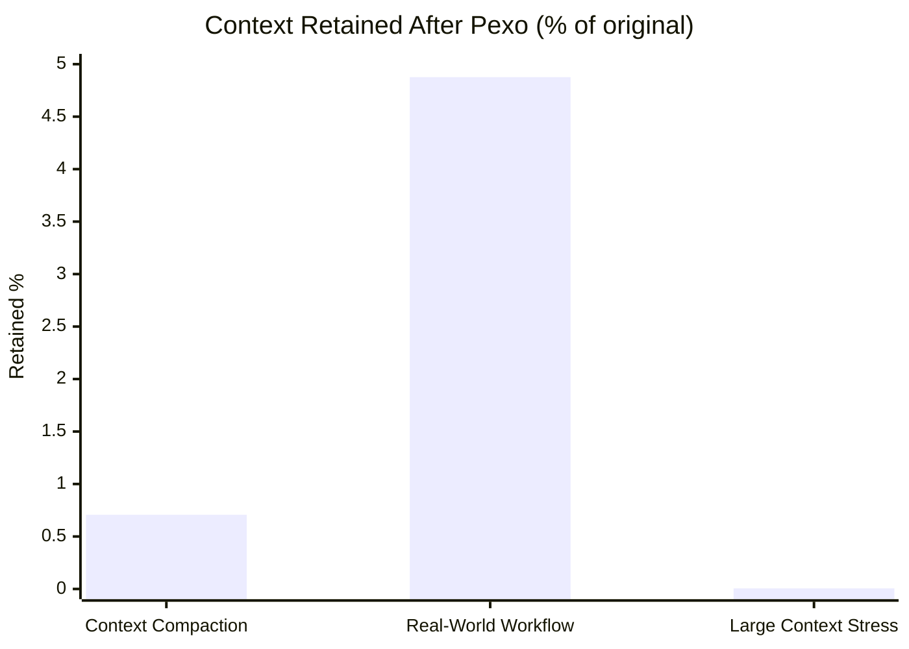

## Benchmark Rollup

These are real local benchmarks for wall time, CPU time, peak RSS, on-disk state, and Pexo session-context usage.
The only estimated figure is the **naive before-Pexo context load**, which is approximated as `bytes / 4` so the direct path can be compared against Pexo's measured session telemetry.

Raw benchmark artifacts:

- `docs/benchmarks/context_compaction_results.json`
- `docs/benchmarks/operator_workflow_results.json`
- `docs/benchmarks/large_context_stress_results.json`

### Host System

- OS: `Windows-11-10.0.26200-SP0`
- CPU: `Intel(R) Core(TM) i9-14900K`
- Logical cores: `32`
- RAM: `47.72` GB
- Python: `3.12.10`
- Pexo version: `1.1.1`
- Pexo memory backend: `keyword`
- Pexo execution mode during rollup runs: `checkout`

### Data Usage Before vs After Pexo

```mermaid
xychart-beta
    title "Context Usage Before vs After Pexo (thousands of tokens)"
    x-axis ["Context Compaction", "Real-World Workflow", "Large Context Stress"]
    y-axis "Tokens (thousands)" 0 --> 48600
    bar "Before Pexo" [3938.4, 764.14, 48599.91]
    bar "After Pexo" [27.84, 37.26, 2.79]
```

### Combined Suite Summary

| Suite | Workloads | Dataset Size | Before Pexo | After Pexo | Retained | Reduction |
| :--- | ---: | ---: | ---: | ---: | ---: | ---: |
| Context Compaction | `10` | `15,753,615` bytes | `3,938,402` tokens | `27,840` tokens | `0.7069%` | `141.47x` |
| Real-World Workflow | `10` | `2,189,892` bytes | `764,137` tokens | `37,264` tokens | `4.8766%` | `20.51x` |
| Large Context Stress | `1` | `194,399,656` bytes | `48,599,914` tokens | `2,790` tokens | `0.0057%` | `17419.32x` |

### Machine Impact Per Suite

| Suite | Direct Time | Pexo Time | Overhead | Direct RSS | Pexo RSS | RSS Delta | Pexo State |
| :--- | ---: | ---: | ---: | ---: | ---: | ---: | ---: |
| Context Compaction | `0.039` s | `3.845` s | `3.806` s | `112.68` MB | `113.38` MB | `0.70` MB | `49.09` MB |
| Real-World Workflow | `0.037` s | `4.098` s | `4.061` s | `113.00` MB | `113.28` MB | `0.28` MB | `7.21` MB |
| Large Context Stress | `0.340` s | `6.705` s | `6.365` s | `109.88` MB | `113.86` MB | `3.98` MB | `394.84` MB |

### Overall Totals

- Total data across all benchmark suites: `212,343,163` bytes
- Total naive before-Pexo context: `53,302,453` tokens
- Total Pexo session context: `67,894` tokens
- Overall retained context after Pexo: `0.1274%`
- Overall reduction factor: `785.08x`

### How To Read This

- **Before Pexo** is the naive context load you would pay if you shoved the source material directly into the model path.
- **After Pexo** is what the Pexo-managed session actually carried according to recorded `context_size_tokens` telemetry.
- The timing numbers are true wall-clock and CPU measurements on this machine.
- The token comparison is partly measured and partly derived: Pexo tokens are measured, the direct-path token count is estimated from bytes.
- The large stress suite dominates the raw chart by design. The retained-percent chart shows the same data normalized.
